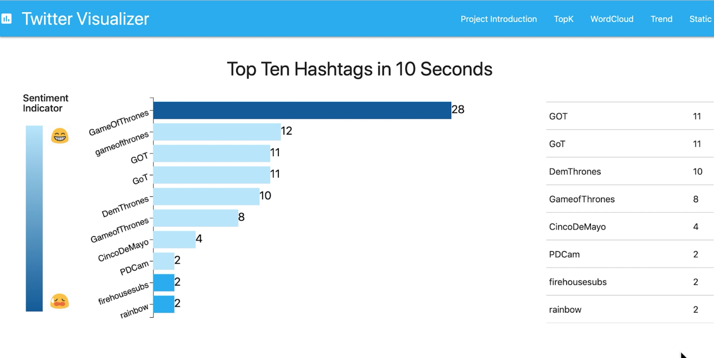
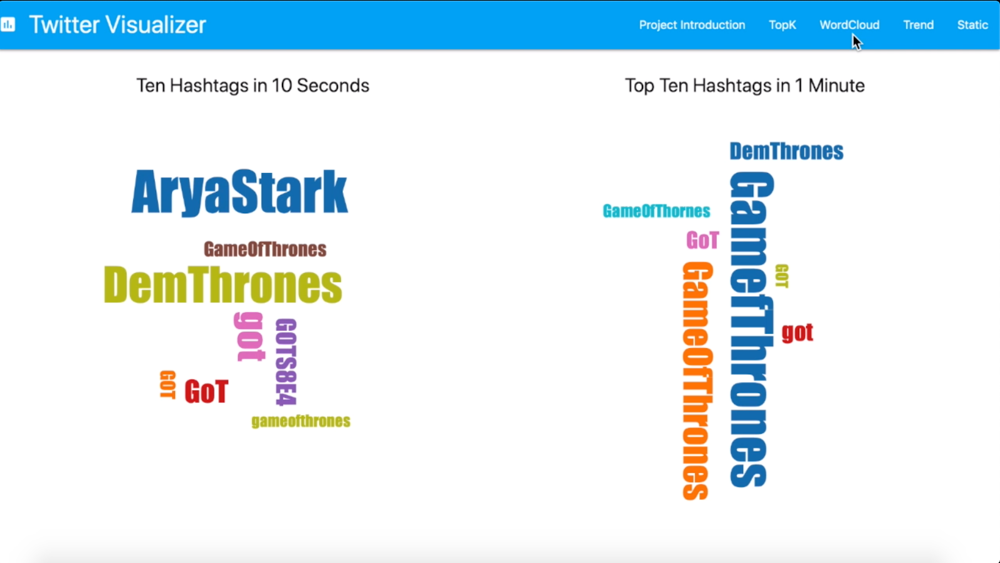
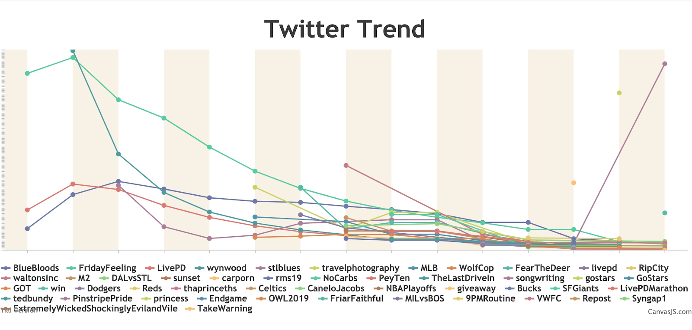
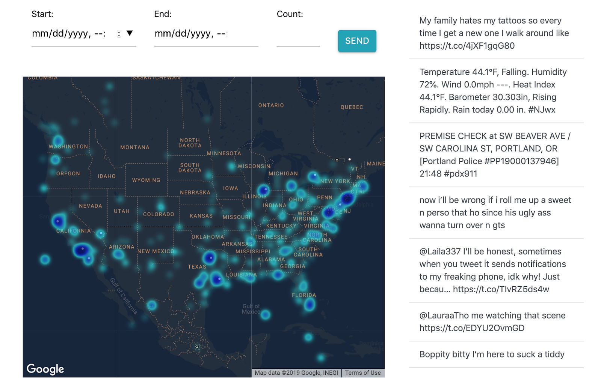

# Twitter Stream Processing
## Team members:

Zhicheng Wu, Linnan Li, Penghe Zhang, Boyuan Sun

## Instructions

Streaming system functions:

| Functions      | Colab |
| ----------- | ----------- |
| Main App in Jupyter |        |
| Main App in Production |        |
| Load Stream      |        |
| Kafka Consumer and Producer   |       |

Visualization p:

Real-time Top K Hashtags (D3.js):

Twitter Trend (Chart.js):

Twitter Statistics:

